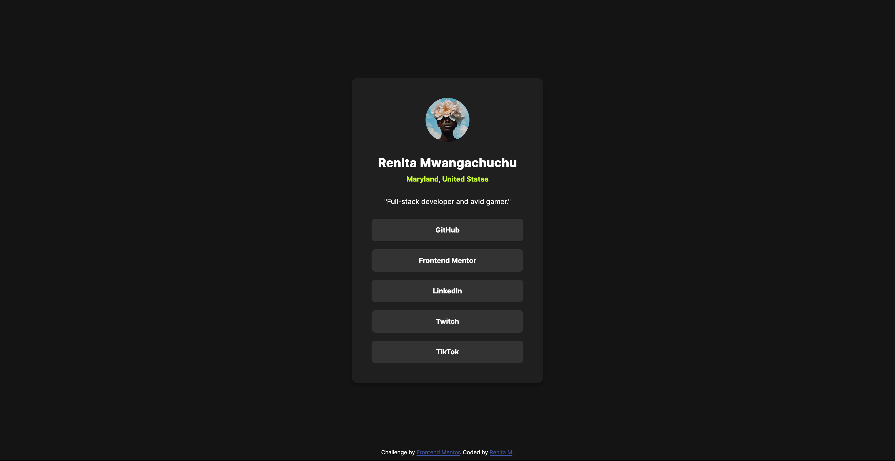

# Frontend Mentor - Social links profile solution

This is a solution to the [Social links profile challenge on Frontend Mentor](https://www.frontendmentor.io/challenges/social-links-profile-UG32l9m6dQ). Frontend Mentor challenges help you improve your coding skills by building realistic projects.

## Table of contents

- [Overview](#overview)
  - [The challenge](#the-challenge)
  - [Screenshot](#screenshot)
  - [Links](#links)
- [My process](#my-process)
  - [Built with](#built-with)
  - [What I learned](#what-i-learned)
  - [Continued development](#continued-development)
- [Author](#author)
- [Acknowledgments](#acknowledgments)

**Note: Delete this note and update the table of contents based on what sections you keep.**

## Overview

### The challenge

Users should be able to:

- See hover and focus states for all interactive elements on the page

### Screenshot



### Links

- Solution URL: [Frontend Mentor Solutions URL](https://www.github.com/renitam/social-links-profile)
- Live Site URL: [Social Links Profile page](https://renitam.github.com/social-links-profile)

## My process

- I started off with a desktop version, then added margin properties and max-width values for screen responsiveness. Nothing major since the screen is so small. I used variables in the style.css file for the design system, but didn't use BEM methodology since the html file was so small.

### Built with

- Semantic HTML5 markup
- CSS custom properties
- Flexbox
- Github pages

**Note: These are just examples. Delete this note and replace the list above with your own choices**

### What I learned

When I started this project, it'd been a year or two since I'd done anything web development related period. I had to relearn things like how css stylings work, html tags and ordering, and things like that. Like I forgot that commas in css classes act like or operators, and I needed to use spaces for "and" operators instead. Github pages is way easier to use than I remembered from last time... just the flick of a switch in my repository.

Use this section to recap over some of your major learnings while working through this project. Writing these out and providing code samples of areas you want to highlight is a great way to reinforce your own knowledge.

To see how you can add code snippets, see below:

```html
<h1>Some HTML code I'm proud of</h1>
```
```css
.proud-of-this-css {
  color: papayawhip;
}
```
```js
const proudOfThisFunc = () => {
  console.log('🎉')
}
```

If you want more help with writing markdown, we'd recommend checking out [The Markdown Guide](https://www.markdownguide.org/) to learn more.

### Continued development

I plan on adding a custom cursor for button hovers, and updating the design for accessibility.

## Author

- Website - [Renita Mwangachuchu](https://afrod31ty.github.com/portfolio)
- Frontend Mentor - [@afrod31ty](https://www.frontendmentor.io/profile/afrod31ty)
- Twitter - [@afrod31ty](https://www.twitter.com/afrod31ty)
- Twitch - [@afrod31ty](https://www.twitch.tv/afrod31ty)

**Note: Delete this note and add/remove/edit lines above based on what links you'd like to share.**

## Acknowledgments

This is where you can give a hat tip to anyone who helped you out on this project. Perhaps you worked in a team or got some inspiration from someone else's solution. This is the perfect place to give them some credit.