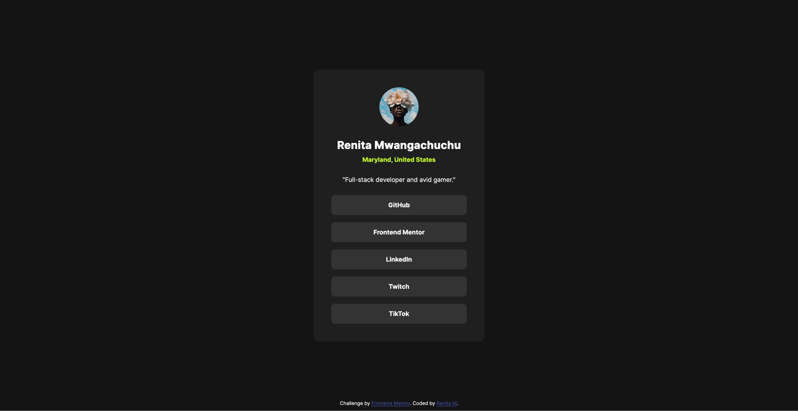

# Frontend Mentor - Social links profile solution

This is a solution to the [Social links profile challenge on Frontend Mentor](https://www.frontendmentor.io/challenges/social-links-profile-UG32l9m6dQ). Frontend Mentor challenges help you improve your coding skills by building realistic projects.

## Table of contents

- [Overview](#overview)
  - [The challenge](#the-challenge)
  - [Screenshot](#screenshot)
  - [Links](#links)
- [My process](#my-process)
  - [Built with](#built-with)
  - [What I learned](#what-i-learned)
  - [Continued development](#continued-development)
- [Author](#author)
- [Acknowledgments](#acknowledgments)

## Overview

### The challenge

Users should be able to:

- See hover and focus states for all interactive elements on the page

### Screenshot



### Links

- Solution URL: [Frontend Mentor Solutions URL](https://www.github.com/renitam/social-links-profile)
- Live Site URL: [Social Links Profile page](https://renitam.github.com/social-links-profile)

## My process

- I started off with a desktop version, then added margin properties and max-width values for screen responsiveness. Nothing major since the screen is so small. I used variables in the style.css file for the design system, but didn't use BEM methodology since the html file was so small.

### Built with

- Semantic HTML5 markup
- CSS custom properties
- Flexbox
- Github pages

**Note: These are just examples. Delete this note and replace the list above with your own choices**

### What I learned

When I started this project, it'd been a year or two since I'd done anything web development related period. I had to relearn things like how css stylings work, html tags and ordering, and things like that. Like I forgot that commas in css classes act like or operators, and I needed to use spaces for "and" operators instead. Github pages is way easier to use than I remembered from last time... just the flick of a switch in my repository.

I feel like the semantics make sense, although they're not placed perfectly if you know what I'm saying. For instance:

```html
    <main class="card">
      <header class="profile">
        
        <section class="user">
          <h1 class="name">Renita Mwangachuchu</h1>
          <p class="location">Maryland, United States</p>
        </section>
        <p class="about">"Full-stack developer and avid gamer."</p>
      </header>
      <nav class="links">
        <a class="social__link" href="https://www.github.com/renitam" target="_blank"
          ><p class="social__text">GitHub</p></a
        >
        <a
          class="social__link"
          href="https://www.frontendmentor.io/profile/renitam"
          target="_blank"
          ><p class="social__text">Frontend Mentor</p></a
        >
        <a
          class="social__link"
          href="https://www.linkedin.com/in/mwangachuchu/"
          target="_blank"
          ><p class="social__text">LinkedIn</p></a
        >
        <a class="social__link" href="https://www.twitch.tv/afrod31ty" target="_blank"
          ><p class="social__text">Twitch</p></a
        >
        <a
          class="social__link"
          href="https://www.tiktok.com/@afrod31ty"
          target="_blank"
          ><p class="social__text">TikTok</p></a
        >
      </nav>
    </main>
```

### Continued development

I plan on adding a custom cursor for button hovers, and updating the design for accessibility. [COMPLETED 5/2/25]

## Author

- Website - [My portfolio](https://renitam.github.com/portfolio)
- Frontend Mentor - [@renitam](https://www.frontendmentor.io/profile/renitam)
- Twitter - [@afrod31ty](https://www.twitter.com/afrod31ty)
- Twitch - [@afrod31ty](https://www.twitch.tv/afrod31ty)

## Acknowledgments

Downloading the cursor svg from the Figma and using the url() cursor option took 2 seconds or less. 